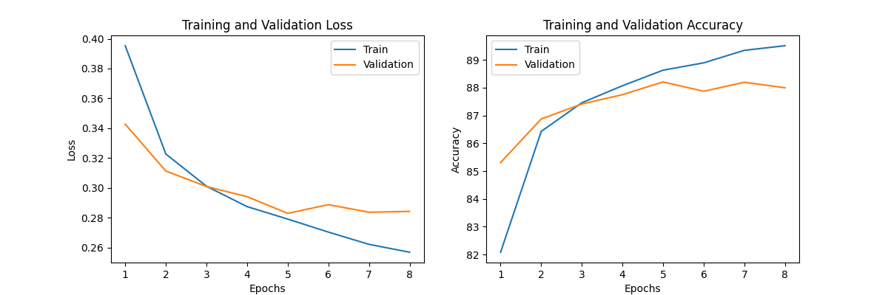
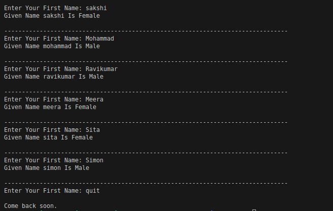
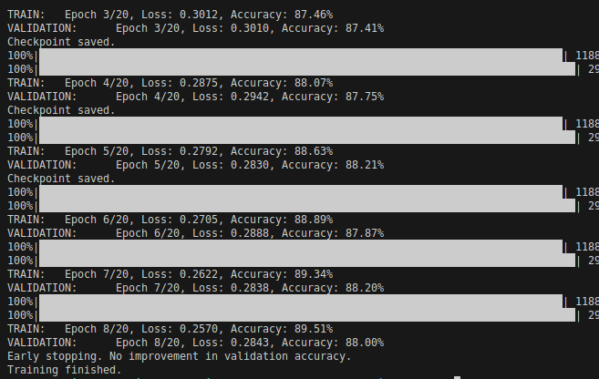

# Gender-Prediction-From-First-Name

Trained model its overfitting after 5 epochs, for more accuracy, try adding regularization or dropout to model to decrease the variance.

Here are the examples that have predicted using trained mode.

Traning process.

